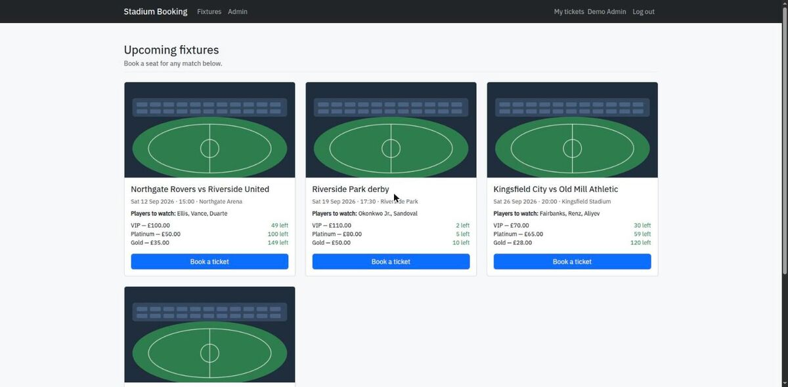
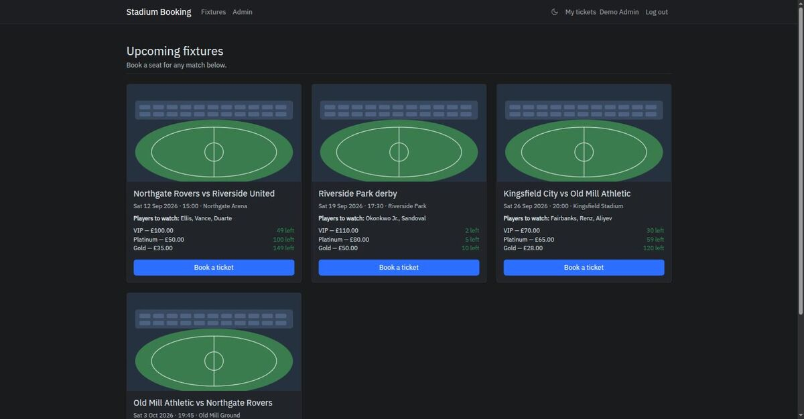
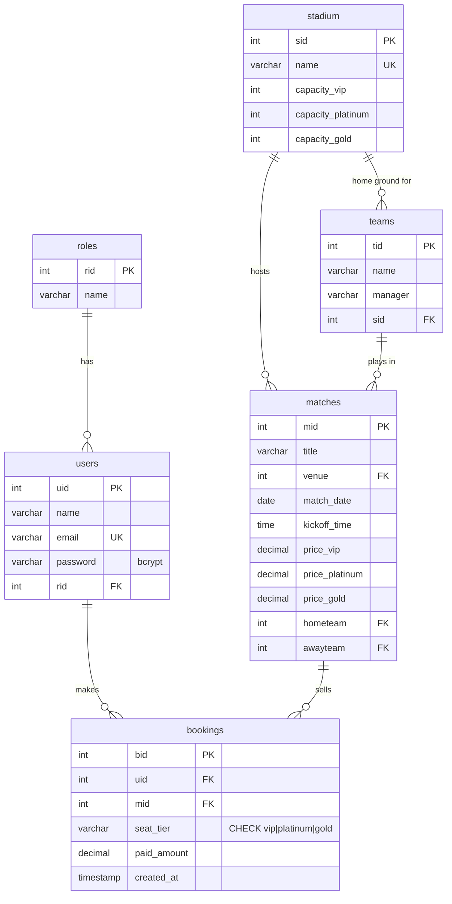
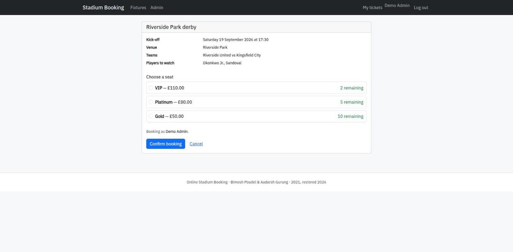
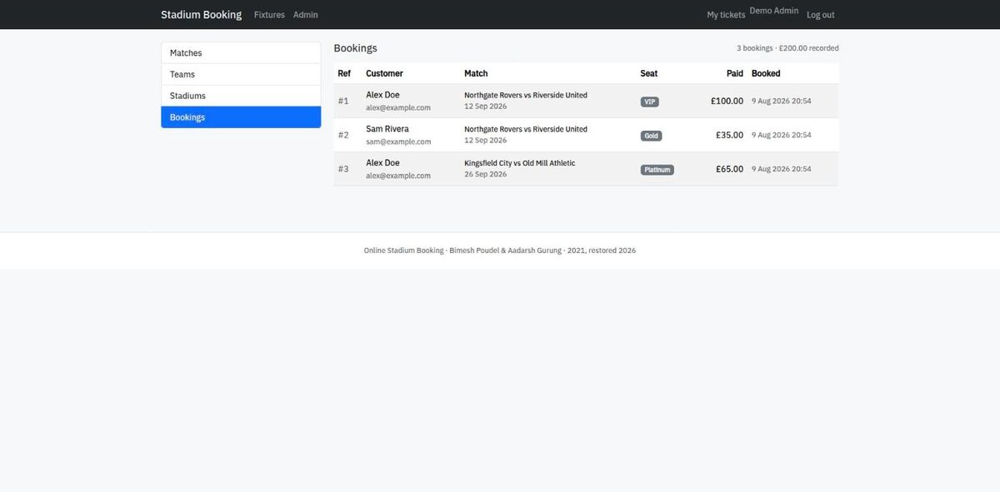

# Online Stadium Booking

A stadium ticket-booking system I wrote in my third year of engineering, found
five years later, and rebuilt — because reading it back showed the admin panel
had no access control and the booking flow would happily oversell a stadium.

<p align="center">
  
  
</p>

The 2021 code is preserved unmodified in [`legacy/`](legacy), so the whole thing
reads as a diff. What changed and why is in
[docs/SECURITY-FINDINGS.md](docs/SECURITY-FINDINGS.md) — twenty defects, each
with the original code, the failure it caused, and the fix.

---

## Run it

Docker is the only requirement.

```bash
git clone <this repo> && cd stadium-booking
cp .env.example .env
docker compose up -d
```

Then open <http://localhost:8080>. The schema and demo data apply themselves on
first boot.

| Role  | Email               | Password      |
|-------|---------------------|---------------|
| Admin | `admin@example.com` | `Admin!2345`  |
| User  | `alex@example.com`  | `Passw0rd!23` |

Verify the claims below rather than taking them on trust:

```bash
./tests/verify.sh        # 18 assertions over HTTP: auth, CSRF, capacity, constraints
./tests/concurrency.sh   # 24 workers race for 4 seats
```

---

## The two bugs worth reading about

### The admin panel was open to everyone

`legacy/admin/index.php` included the dashboard unconditionally. No session
check, no role check. Requesting `/booking/admin` logged out returned the full
admin interface with create access to fixtures and read access to every customer
booking.

The mechanism to stop it was already there: `users.rid` was populated, a `roles`
table existed, and the login code read the column — to decide where to *redirect*
you:

```php
if ($row['rid'] == 1) { header('Location: .../admin'); }
else                  { header('Location: .../'); }
```

The role picked which URL you were sent to. Nothing picked which URLs you were
allowed to visit. That is the entire bug, and it is the one I find most worth
keeping in mind: authorisation implemented as navigation looks completely fine
when you click through it as the developer.

Now `require_admin()` runs as the first statement of the admin entry point,
before any routing. Anonymous requests get redirected to log in; authenticated
non-admins get 403.

### Seat availability was wrong, and the way it was wrong hid itself

```php
$bookingsqlA = "select bid from `bookings` where `seattype` = 'a'";
$bookedSeatsA = countSeats($bookingsqlA);
...
echo ($totalA - $bookedSeatsA)
```

Two bugs in four lines. There is no `WHERE mid`, so every booking in the table
was subtracted from every match — sell out one fixture and all the others lose
seats. And the query matches `seattype = 'a'` while the insert wrote `'priceA'`,
so after that format changed the count matched nothing and always returned zero.

The second bug masked the first. With the count pinned at zero, the cross-match
contamination never showed up in testing. Both formats are still visible in the
recovered data, which is how I found it.

Worse, none of it mattered: the display was decorative. Nothing consulted it
before writing, and there was no constraint behind it either.

**Fixing the count is not enough.** The obvious repair — `SELECT COUNT(*)`,
compare, then insert — still oversells, because concurrent requests all read the
same count before any of them writes. `tests/concurrency.sh` measures all three
approaches with 24 workers competing for 4 seats:

```
  no capacity check   (the original)             sold  24 / 4   oversold by 20
  check, then insert  (the obvious fix)          sold  24 / 4   oversold by 20
  SELECT ... FOR UPDATE (src/config/booking.php) sold   4 / 4   exactly 4
```

The lock does the work, not the check. The two failing strategies run on every
invocation on purpose — a concurrency test that has never been seen to fail is
not evidence of anything.

```php
// src/config/booking.php
$pdo->beginTransaction();
    // FOR UPDATE OF m locks the match row only; without `OF m` the joined
    // stadium row locks too, serialising unrelated matches at the same ground.
    SELECT m.mid, m.price_x, s.capacity_x
      FROM matches m JOIN stadium s ON s.sid = m.venue
     WHERE m.mid = :mid FOR UPDATE OF m

    SELECT COUNT(*) FROM bookings WHERE mid = :mid AND seat_tier = :tier
    // reject if count >= capacity
    INSERT INTO bookings ...
$pdo->commit();
```

with `UNIQUE (mid, uid, seat_tier)` in the schema as a backstop, because the
application will not always be the only thing writing to this table.

---

## Recovering the schema

The original shipped no `.sql` file, and the XAMPP database it assumed did not
survive. The only record of the schema was a set of phpMyAdmin screenshots
embedded in the project report.

A `.docx` is a zip archive, so the images are extractable and can be tied back to
their captions through `document.xml`. `docs/extract-screenshots.py` does this;
the reconstruction is written up in
[docs/schema-recovery.md](docs/schema-recovery.md).

Two bugs were visible in the recovered *data* before I read any PHP: the
`seattype` column holding two incompatible vocabularies, and `matches` having no
date column at all — `time` was a `VARCHAR` holding strings like `01:00 UKT`.



The recovered schema had **no foreign keys, no unique constraints and no check
constraints** — consistent with tables created by hand through the phpMyAdmin
UI. `db/schema.sql` adds them, marking every departure from the original with
`[NEW]`.

One is worth mentioning because MySQL forced the choice. `chk_matches_distinct_teams`
(a team cannot play itself) is rejected if the same column also carries a foreign
key with a referential action — `ERROR 3823`. Since `tid` is a surrogate key that
is never updated, `ON UPDATE CASCADE` bought nothing there, so the FKs became
`ON UPDATE RESTRICT` and the check survived.

---

## What changed

| | 2021 | Now |
|---|---|---|
| Admin access | none | `require_admin()`, 302 anon / 403 non-admin |
| Passwords | unsalted MD5 | bcrypt, with transparent upgrade of legacy hashes |
| Queries | string interpolation + hand-rolled `sanitize()` | prepared statements, escaping on output |
| CSRF | none | per-session tokens on every POST |
| Booking | bare INSERT | transaction + row lock + UNIQUE |
| Seat counts | table-wide, matched nothing | scoped to the match |
| Credentials | `root`/empty, in the document root | environment, outside the docroot |
| Errors | SQL echoed to the page | logged, not displayed |
| Fixtures | no date column | `match_date` + `kickoff_time`, indexed |
| Theming | none | light/dark, follows the OS, remembers your choice |
| Runs on | Windows + XAMPP only | anywhere with Docker |

### Theming

Light and dark, driven by Bootstrap 5.3's native `data-bs-theme`. It follows
`prefers-color-scheme` until you touch the toggle, after which your choice is
remembered.

The theme is applied by a small inline script in `<head>`, before any stylesheet
loads — otherwise the page paints in the default theme and then corrects itself,
which is a visible flash on every navigation. Colours are declared once per theme
as tokens in `style.css`, so a third theme would be one block rather than a hunt
through hex values.

<p align="center">
  
  
</p>

For comparison, the 2021 interface is preserved in
[`docs/screenshots/`](docs/screenshots) as `ui-*` — including `ui-08-my-tickets.png`,
which shows the unstyled page that resulted from `myticket.php` including neither
header nor footer.

---

## Layout

```
├── src/
│   ├── config/       db, auth, csrf, booking logic, helpers
│   ├── public/       the only web-served directory
│   ├── admin/        admin handlers, reached via src/public/admin.php
│   └── views/        shared layout
├── db/               schema.sql, seed.sql
├── legacy/           the 2021 code, unmodified
├── tests/            verify.sh, concurrency.sh, race.php
└── docs/             findings, schema recovery, screenshots
```

Still procedural PHP, deliberately. Rewriting it in a framework would have
produced a different project and thrown away the only interesting thing about
this one: a measurable before and after.

## Not included

No payment gateway — `paid_amount` records what a ticket cost, nothing takes
money. No cancellations, no email delivery, no rate limiting on login. These are
listed in the findings document rather than quietly implied.

## Credits

Original coursework, 2020–21: **Bimesh Poudel** and **Aadarsh Gurung**,
Department of Computer Science & Engineering, Dr. Ambedkar Institute of
Technology, Bengaluru. Supervised by Prof. Veena Potdar.

2026 restoration and hardening: **Bimesh Poudel**.

The original coursework was built on a publicly available PHP booking template.
The restoration described here is my own work.
